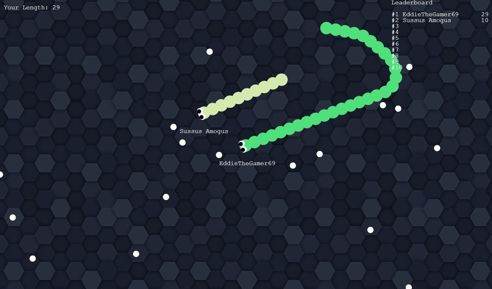

# Snek.io
You can try out the game on this Heroku server: https://snek-dot-io.herokuapp.com/  
No one else will be playing of course, but you can open it in 2 tabs to test it out  
My first online multiplayer game!  
This is a recreation of the popular multiplayer online browser game [Slither.io](http://slither.io/) with Socket.io and the javascript game engine Phaser 3

# How to play
From https://en.wikipedia.org/wiki/Slither.io:  
> The objective of the game is to control a worm around a wide area and eat pellets, defeating and consuming other players to gain mass to grow the largest and longest in the game.

> "normal" pellets spawn naturally throughout the world.

> If the player's worm's head collides into a part of another worm, the player will die.

> The defeated avatar's body turns into bright, shining pellets for other players to consume, equivalent to the amount of mass it took for the defeated avatar to get that long.

> By pressing and holding the left mouse button, the player can use their boost, which causes the avatar to speed up. When a player uses their boost, the worm loses some mass

> On each server, leaderboards are displayed at the top right, showing the top ten players with worms that have the most mass out of all the other worms in the entire server.
